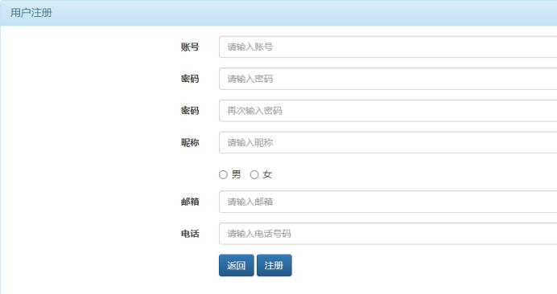

# movieWeb  JavaWebMovieSystem

## Project Requirements

### 一、功能要求:
1. 登录  

2. 注册  

3. 我的订单列表  

4. 电影放映计划与购票  

5. 销售统计结果  

6. 退出  

### 二、非功能要求
1. 需要做服务端的数据校验，以检查客户传入的数据是否符合要求
2. 用户，订单，统计数据及余票需要做更新
3. 我的订单，购票及销售统计需要登录后才能访问
4. 采用统一的响应格式及异常处理

### 三、数据说明
1. 电影，放映计划可采用静态数据
2. 我的订单，销售统计及余票均是动态数据

### 四、技术要求
1. 前端不限定 是客户端渲染还是服务端绘制方式，也不限定是单页面还是多页面
2. 服务端基于Spring Boot 来实现。
3. 推荐采用前后端分离的技术来实现。

### 要点分析：
- 静态数据及动态更新
- 跨站问题
- 访问控制
- 数据格式有效性校验
- 统一响应格式
- 统一异常处理

### 另外
- 该项目无需host
- 无需数据库
- only coding
